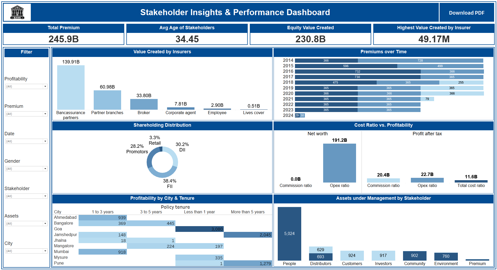

# 📊 Stakeholder Insights & Performance Dashboard | Tableau

🔗 **View Live Dashboard on Tableau Public**  
*([Add the Tableau Public URL once published](https://public.tableau.com/app/profile/ishan.prabhune/viz/StakeholderInsightsPerformanceDashboard_17499454320880/StakeholderInsightsPerformanceDashboard))*

---

## 📌 Project Overview

The **Stakeholder Insights and Performance Dashboard** offers a comprehensive view of key business metrics and trends related to stakeholders, insurers, and policy performance. This interactive Tableau dashboard enables decision-makers to monitor premium collections, assess profitability, analyze asset distribution, and derive actionable insights to support strategic planning.

---

## 🎯 Dashboard Objectives

- Provide visual analysis of premium and profitability trends
- Compare insurer performance and value creation
- Understand asset distribution and demographic breakdown
- Enable role-based access for secure, stakeholder-specific views
- Offer PDF export capabilities for easy sharing

---

## 📈 Key Features & Functional Requirements

### 📊 Charts and Visualizations
- **Total Value by Insurer**: Bar chart comparing value created
- **Premium Trends Over Time**: Line chart to analyze historical changes
- **Shareholding Pattern Distribution**: Pie or bar chart by stakeholder
- **Cost Ratio vs. Profitability**: Scatter plot to explore correlation
- **City & Tenure-based Profitability**: Heatmaps or bar visuals
- **Asset Distribution**: Treemap/bar chart of assets under management

### 📋 Key Performance Indicators (KPIs)
- Total premium collected
- Average stakeholder age
- Total value created (Equity-managed)
- Highest single value created by an insurer

### 🔍 Filters
- By city
- By stakeholder
- Policy tenure (range slider)
- Date range
- Gender

### 🧠 Interactivity
- **Cross-filtering**: Click charts to filter other visuals
- **Dynamic KPIs**: Update based on filter selections
- **Tooltips**: Hover to see detailed insights

### 🖨️ Export Options
- **Export to PDF** with:
  - All visible charts, filters, and KPIs
  - Light company watermark
- Maintains applied filter states for contextual exports

### 🔐 User Access
- **Role-based access**: Different stakeholders see data relevant to their role (e.g., insurers, policyholders)

---

## 🧭 Usage Instructions

### 🧪 Navigating the Dashboard
1. Use filters (top/side panel) to refine by:
   - City
   - Stakeholder
   - Policy tenure
   - Gender
   - Date range
2. Click any chart segment to filter other visuals interactively
3. Hover on data points for contextual insights via tooltips

### 🖨️ Exporting the Dashboard
1. Click the **Export to PDF** button in the toolbar
2. Confirm filter states and selections
3. Download includes all current visuals with watermark branding

### 🔓 Accessing Role-Specific Views
1. Log in with your credentials
2. Data visibility adapts based on your assigned role

---

## 🧰 Tools & Technologies

- **Tableau Public** – Dashboard development and sharing  
- **Synthetic Data** – Simulated using Python/ChatGPT/Faker  
- **Interactive UI** – Built-in Tableau filtering, tooltips, and dashboard actions

---

